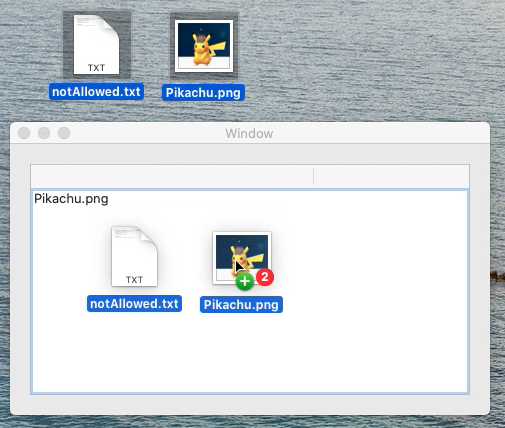

# DragAndDrop_OtherToTable
This is a minimum sample code to drag and drop files from other app to NSTableView object in macOS.

[movie in YouTube](https://youtu.be/CllaecpLt6U)

macOS Catalina 10.15.2  
Swift 5.1.3  
Xcode 11.3.1  
